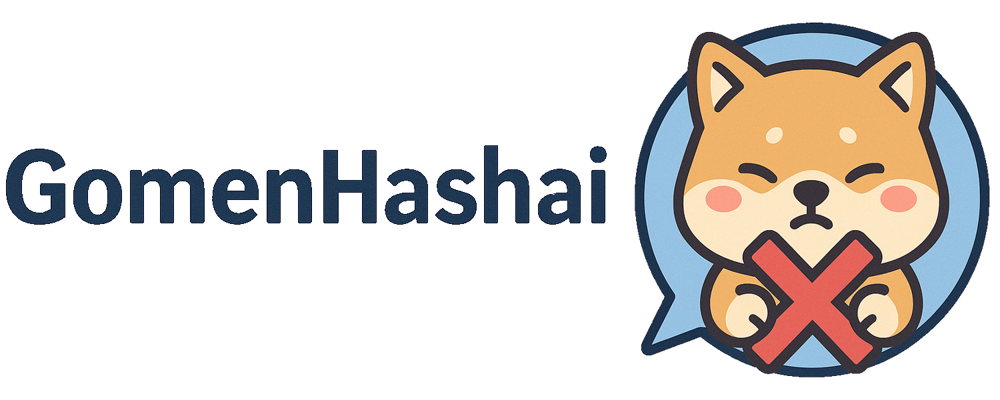

# 🍣 GomenHashai 🐾

Keep your Kubernetes cluster safe by ensuring all container's images use digests from a trusted set. GomenHashai verifies image integrity and gently apologizes as it gracefully denies or terminates pods that don’t meet the standard. Gomen Hashai~ 🙇

Built with security 🛡️ in mind, 🍣 GomenHashai ships with strong default protections.



*✨ “GomenHashai” is a playful mix of “Gomen nasai” (ごめんなさい – Japanese for “I’m sorry”) and “Hash,” referencing image digests. Because it says sorry when it denies your pods 😄. 🍣*

---

## 📚 Table of Contents

- [✨ What It Does](#-what-it-does)
- [🚀 Getting Started](#-getting-started)
- [🍣 Usage](#-usage)
- [🔧 Configurations](#-configurations)
- [🐶 Release](#-release)
- [📄 License](#-license)

---

## ✨ What It Does

### 🌀 Mutating Admission Webhook

Automatically rewrites container images in Pods to include a trusted digest (e.g., nginx:1.27.5 -> nginx:1.27.5@sha256:...).

### 🛡️ Validating Admission Webhook

Denies Pods that uses containers without trusted digests.

Ensures every container image matches a digest listed in a trusted Secret.

### ↩️ Handles Already Existing pods

Can submit automatically already existing pods to the webhook to make sure they use a digest. It can potentially delete pods using untrusted digests/images.

### 🔐 Trusted Digest Store

Uses a Kubernetes Secret to store a mapping of image name -> digest.

Example:

```yaml
apiVersion: v1
kind: Secret
metadata:
  name: gomenhashai-digests-mapping
type: Opaque
stringData:
  digests_mapping.yaml: |
    "busybox:latest": "sha256:37f7b378a29ceb4c551b1b5582e27747b855bbfaa73fa11914fe0df028dc581f"
    "busybox": "sha256:e246aa22ad2cbdfbd19e2a6ca2b275e26245a21920e2b2d0666324cee3f15549"
    "library/busybox": "sha256:e246aa22ad2cbdfbd19e2a6ca2b275e26245a21920e2b2d0666324cee3f15549"
    ...
```


### 📦 Helm Chart

Deploy the entire setup in one command with Helm.

Includes webhook deployment, certificates (with cert-manager), and RBAC.

The provided Helm chart follows Kubernetes security best practices out of the box.

### 🐳 Registry Modification

Mutating webhook can also be used to enforce a common registry for all images.

### ⛩️ Exemptions

It is possible to exempt a list of images, or even use regex to exempt images.

The Helm Chart will exempt the namespace in which you install 🍣GomenHashai, you can exempt other namespaces as well.

### ⚠️ Warning

Running without configuring much may break stuff in your cluster, 🍣GomenHashai 🙇. Be careful providing a complete mapping for images/digests or set exemptions for your important cluster services (CNI, control-plane, api server...).

---

## 🚀 Getting Started

1. Prerequisites
  
    - A Kubernetes cluster (e.g., Minikube, GKE, EKS)
    - Helm 3 installed
    - A list of trusted image digests you want to enforce

2. Prepare your trusted digest mapping

    Prepare a yaml file to configure the digest mapping for the Helm Chart installation:

    my-values.yaml
    ```yaml
    digestsMapping:
      mapping:
        "library/nginx": "sha256:d43bdb28bae0be0998f3be83199bfb2b81e0a30b034b6d7586ce7e05de34c3fd"
        "curlimages/curl:8.13.0": "sha256:d43bdb28bae0be0998f3be83199bfb2b81e0a30b034b6d7586ce7e05de34c3fd"
        ...
    ```

3. Add the GomenHashai Helm Repository

    ```sh
    helm repo add gomenhashai https://marcantoineRaymond.github.io/GomenHashai
    helm repo update
    ```

4. Install GomenHashai

    Deploy GomenHashai into your cluster using Helm:

    ```sh
    helm install gomenhashai gomenhashai/gomenhashai \
      --namespace gomenhashai-system \
      --create-namespace \
      --values my-values.yaml
    ```

    This command installs GomenHashai in the gomenhashai-system namespace. A secret is created with the mapping you provided.

5. Test the setup

    Creating a pod with an untrusted image will fail:

    ```sh
    kubectl run test --image=curlimages/curl:7.66.0
    Error from server (Forbidden): admission webhook "vpod-v1.kb.io" denied the request: Pod "test" is forbidden: spec.containers[0].image: Forbidden: image is not using a digest
    ```

    But creating one with a trusted image will succeed and the container is using the digest:

    ```sh
    kubectl run test --image=curlimages/curl:8.13.0
    kubectl get pods test -o yaml | grep 'image:'
      image: curlimages/curl:8.13.0@sha256:d43bdb28bae0be0998f3be83199bfb2b81e0a30b034b6d7586ce7e05de34c3fd
    ```

Read the [Usage section](docs/usage.md) of the documentation for informations on different use cases and an in depth look at how to properly set everything up.

---

## 🍣 Usage

As explained in the previous sections, GomenHashai has many cool features.

Read the [Usage section](docs/usage.md) of the documentation for informations on different use cases and an in depth look at how to properly set everything up.

---

## 🔧 Configurations

You can customize the trusted digest secret content, certificate handling, namespace filters, webhook behavior and much more. See the full chart configuration in [`deploy/charts/gomenhashai/values.yaml`](./deploy/charts/gomenhashai/values.yaml).

You should also read the [certificate management section](docs/certificates_management.md) to understand how to configure certificate management to better fit your needs.

A YAML configuration file can be used to customize the processing behaviour in addition to the other Helm Chart configurations:

```yaml
config:
  # -- Path to the digests mapping file
  digestsMappingFile: "/etc/gomenhashai/digests/digests_mapping.yaml"
  # -- List of images to skip, can contain regex ex: ".*redis:.*"
  exemptions: []
  # -- If the image in the mapping does not have a tag it will be used as default for this image if the container is using a tag that is not in the mapping
  imageDefaultDigest: true
  # -- Can be warn or fail (default)
  validationMode: "fail"
  # -- Enable to not modify pods but instead logs (pods will fail validation unless you disable it or set it in warn)
  mutationDryRun: false
  # -- Enable modifying the registry part of images with the value of MutationRegistry
  mutationRegistryEnabled: false
  # -- The registry to inject when MutationRegistryEnabled is true
  mutationRegistry: ""
  # -- Configuration of the process that handles existing pods on init
  existingPods:
  # -- Enable the init function that will process existing pods at startup
      enabled: true
  # -- Timeout used to wait before starting this job in seconds
      startTimeout: 5
  # -- Timeout used to wait before retrying to process pods that failed in seconds
      retryTimeout: 5
  # -- How many times we should retry processing pods that failed
      retries: 5
  # -- Replace already existing pods with output from webhook, if disabled webhook will be used with dry run to not modify pods
      updateEnabled: true
  # -- Allow deleting existing pods that are forbidden by webhook
      deleteEnabled: true
```

The configuration file path can be overwritten by the environment variable `GOMENHASHAI_CONFIG_PATH` but you do not need this as the file will be created and the correct mountPoint will be created by the Chart.

Using this configuration it is possible to disable the job that process existing pods: `existingPods.enabled`

It is also possible to run this tool without blocking pods: `validationMode: warn`

Each variable can be overwritten by an environment variable.

The variable starts with `GOMENHASHAI_` and follows with the variable name in upper case: `GOMENHASHAI_VALIDATIONMODE` or `GOMENHASHAI_EXISTING_PODS_ENABLED`, ommitting the `GOMENHASHAI_` will also work but it is better to keep it.

---

## 🐶 Release

You can find note on our release process on the [dedicated page](docs/release_process.md).

---

## 📄 License

This project is licensed under the **Apache License 2.0**. See the [LICENSE](./LICENSE) and [NOTICE](./NOTICE) files for details.
